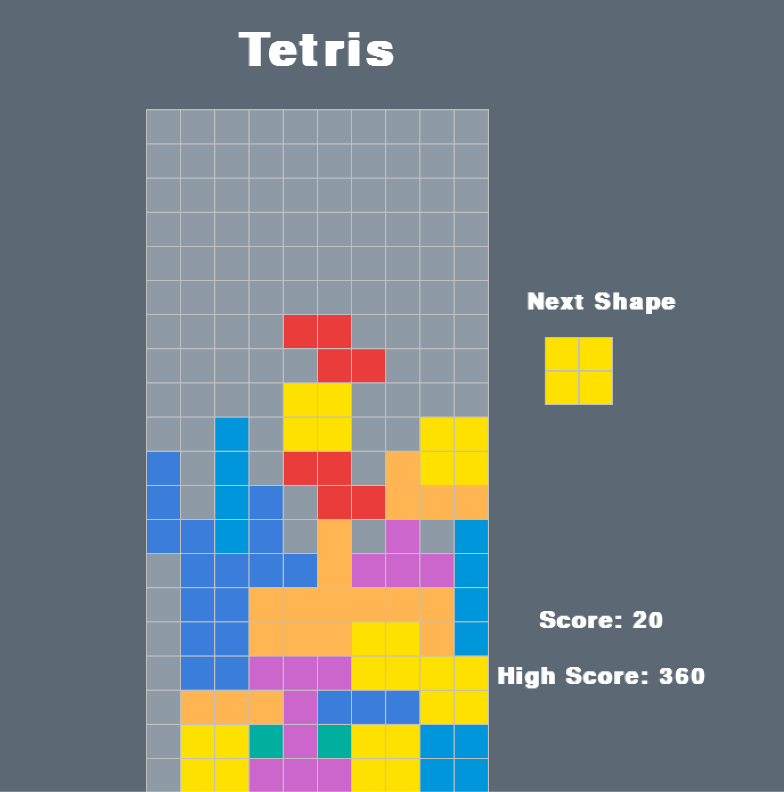

# Pygame Tetris Game

## Installation
Install pygame on your local drive or virtualenv. Download the files and run using `python tetris.py`.

To play: use left, right and down keys to control the tetris blocks. Rotate the shape using spacebar. 

To increase the difficulty (rate of block falling), decrease the `fall_time` parameter in the `main_helper()` function.
